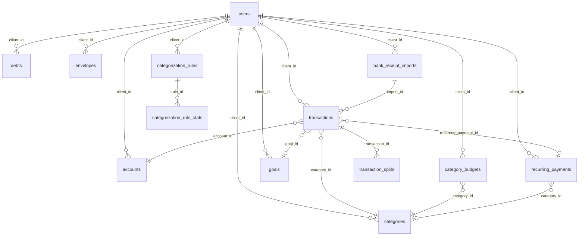

# Finance Tracker — Codemap & Architecture Analysis

> Карта кодовой базы, архитектурные решения и рекомендации по улучшению.
> Обновлено: 2026-03-03

---

## 1. Структура репозитория

```
finance-tracker/
├── api/                          # Laravel 11 backend
│   ├── app/
│   │   ├── Console/              # Artisan команды и планировщик
│   │   ├── Enums/                # PHP Enums
│   │   ├── Events/               # DataUpdated → Reverb WebSocket
│   │   ├── Exceptions/           # Handler: JSON ответы вместо HTML
│   │   ├── Http/
│   │   │   ├── Controllers/Api/  # Тонкие контроллеры
│   │   │   │   ├── Experimental/ # Экспериментальные фичи (BankReceipt)
│   │   │   ├── Middleware/       # JWT, AdminMiddleware, ExperimentalFeature
│   │   │   └── Requests/         # FormRequest валидация
│   │   ├── Models/               # Eloquent + глобальный scope по client_id
│   │   ├── Providers/            # ServiceProvider, AuthProvider
│   │   ├── Repositories/         # TransactionRepository + интерфейс
│   │   └── Services/             # Бизнес-логика (27 сервисов)
│   │       └── Experimental/     # ReceiptAnalysis, ReceiptMatching, CsvParser, ImportRule
│   ├── database/
│   │   ├── migrations/           # ~50 миграций
│   │   └── seeders/
│   ├── routes/api.php            # Все API маршруты
│   └── tests/                    # PHPUnit тесты
│
├── web/                          # Vite 5 + TypeScript SPA
│   ├── src/
│   │   ├── api/
│   │   │   ├── client.ts         # Единственный HTTP-клиент (JWT, batch, retry)
│   │   │   ├── admin.ts          # Отдельный клиент для /api/admin/*
│   │   │   └── experimental.ts   # Отдельный клиент для /api/experimental/*
│   │   ├── app.ts                # Точка входа: роутинг табов, bootstrap, WebSocket
│   │   ├── components/           # 23 компонента (kebab-case)
│   │   ├── pages/                # 12 страниц (camelCase, extends BasePage)
│   │   ├── services/             # 16 сервисов (*.service.ts)
│   │   ├── store/                # Глобальный store (categories, rates, balance)
│   │   ├── types/                # TypeScript интерфейсы
│   │   ├── utils/                # Утилиты (dom, features, format)
│   │   └── views/                # 10 View-классов (PascalCase+View)
│   ├── public/
│   │   └── static/style.css      # ОДИН файл CSS (~6000 строк)
│   ├── index.html                # Основное SPA (все табы)
│   └── admin.html                # Отдельная HTML-страница для админки
│
└── docs/
    ├── PLAN.md                   # Текущий план разработки
    ├── IMPLEMENTED.md            # Реализованные фичи
    ├── CHANGELOG.md              # История версий
    ├── CODEMAP.md                # Этот файл
    ├── PROJECT.md                # Справочник: стек, архитектура, БД, соглашения
    └── ROADMAP.md                # Бизнес-план и идеи
```

---

## 2. Backend — карта файлов

### Controllers (`api/app/Http/Controllers/Api/`)

| Файл | Эндпоинты | Сервис |
|------|-----------|--------|
| `AdminController.php` | `/api/admin/*` | — |
| `AdminPushController.php` | `/api/admin/push/*` | `PushService` |
| `AnalyticsController.php` | `/api/analytics/*` | `AnalyticsService` |
| `AuthController.php` | `/api/login`, `/api/logout`, `/api/me` | `AuthService` |
| `BootstrapController.php` | `/api/bootstrap` | `BootstrapService` |
| `BudgetController.php` | `/api/budget` | `BudgetService` |
| `CalendarController.php` | `/api/calendar/*` | `CalendarService`, `CalendarParserService` |
| `CategoryController.php` | `/api/categories/*` | — |
| `DashboardController.php` | `/api/dashboard` | `DashboardService` |
| `DebtController.php` | `/api/debts/*` | `DebtService` |
| `EnvelopeController.php` | `/api/envelopes/*` | `EnvelopeService` |
| `ExchangeRateService.php` (через SettingsController) | `/api/settings/rates` | `ExchangeRateService` |
| `ForecastController.php` | `/api/forecast` | `ForecastService` |
| `GoalController.php` | `/api/goals/*` | `GoalService` |
| `HealthController.php` | `/api/health` | `HealthService` |
| `IncomeTypeController.php` | `/api/income-types/*` | — |
| `NoteController.php` | `/api/notes/*` | `NoteService`, `NoteAnalysisService` |
| `NoteFolderController.php` | `/api/notes/folders/*` | `NoteFolderService` |
| `PaymentController.php` | `/api/payments/*` | `PaymentService` |
| `PushController.php` | `/api/push/*` | `PushService`, `PushPreferencesService` |
| `RecommendationController.php` | `/api/recommendations` | `RecommendationService` |
| `SearchController.php` | `/api/search` | `SearchService` |
| `SettingsController.php` | `/api/settings/*` | `SettingsService` |
| `SettingsController.php` (telegram) | `/api/settings/telegram/*` | `TelegramBotService` |
| `TransactionController.php` | `/api/transactions/*` | `TransactionService` |
| `Experimental/BankReceiptController.php` | `/api/experimental/bank-receipts/*` | `ReceiptAnalysisService`, `ReceiptMatchingService`, `ImportRuleService` |

### Services (`api/app/Services/`)

| Сервис | Назначение | Зависимости |
|--------|------------|-------------|
| `AccountService` | CRUD счетов, синхронизация баланса | `TransactionRepository` |
| `AnalyticsService` | Расходы по категориям, YoY, аномалии, тренды | `TransactionRepository` |
| `AuthService` | JWT токены, хеширование паролей | — |
| `AiProviderService` | Определение провайдера AI (Groq/OpenAI/Ollama) | — |
| `AiUsageService` | Отслеживание использования AI по пользователям | — |
| `BootstrapService` | Единый ответ `/api/bootstrap` (все данные для старта) | All services |
| `BudgetService` | Месячный бюджет, лимиты, cashflow, конверты | `ForecastService` |
| `CalendarService` | CRUD событий | — |
| `CalendarParserService` | NLP парсинг текста в события | — |
| `CategorizationService` | Автокатегоризация транзакций | — |
| `DashboardService` | Данные для дашборда (баланс, плановые платежи) | — |
| `DebtService` | CRUD долгов, план погашения | — |
| `EnvelopeService` | Конверты, синхронизация spent | — |
| `ForecastService` | Прогноз на 3 мес., сезонные паттерны | — |
| `HealthService` | Финансовый health score 0-100 | — |
| `NoteAnalysisService` | AI суммаризация заметок | `AiProviderService` |
| `NoteFolderService` | Папки для заметок | — |
| `NoteService` | CRUD заметок, full-text search | `NoteAnalysisService` |
| `PaymentService` | CRUD плановых платежей, детекция подписок | — |
| `PushPreferencesService` | Настройки push уведомлений | — |
| `PushService` | Отправка Web Push, Telegram уведомлений | `PushPreferencesService` |
| `RecommendationService` | AI-рекомендации по финансам | — |
| `SearchService` | Поиск по транзакциям, категориям, заметкам | — |
| `SettingsService` | Настройки пользователя (курсы, зарплата, тема) | — |
| `SubscriptionDetectionService` | Детекция повторяющихся платежей | — |
| `TelegramBotService` | Polling, обработка команд, привязка аккаунта | — |
| `TelegramParserService` | Парсинг транзакций из текста бота | — |
| `TransactionService` | CRUD транзакций, splits, автокатегоризация | `AccountService`, `CategorizationService` |
| `Experimental/CsvReceiptParser` | Парсинг CSV банковских выписок | — |
| `Experimental/ExternalApiLogger` | Логирование запросов к внешним API | — |
| `Experimental/ImportRuleService` | CRUD пользовательских правил импорта | — |
| `Experimental/ReceiptAnalysisService` | AI анализ фото/PDF чеков (Groq/OpenAI) | `ExternalApiLogger` |
| `Experimental/ReceiptMatchingService` | Сопоставление транзакций с категориями | — |

### Models (`api/app/Models/`)

| Модель | Таблица | Scope |
|--------|---------|-------|
| `Account` | `accounts` | `client_id` |
| `ActivityLog` | `activity_logs` | — |
| `BankReceiptImport` | `bank_receipt_imports` | `client_id` |
| `BankReceiptIncomeMapping` | `bank_receipt_income_mappings` | `client_id` |
| `BankReceiptMapping` | `bank_receipt_mappings` | `client_id` |
| `CalendarEvent` | `calendar_events` | `client_id` |
| `CategorizationRule` | `categorization_rules` | `client_id` (+ global) |
| `CategorizationRuleStat` | `categorization_rule_stats` | — |
| `Category` | `categories` | `client_id` |
| `CategoryBudget` | `category_budgets` | `client_id` |
| `Debt` | `debts` | `client_id` |
| `Envelope` | `envelopes` | `client_id` |
| `Goal` | `goals` | `client_id` |
| `IncomeType` | `income_types` | `client_id` |
| `NetWorthSnapshot` | `net_worth_snapshots` | `client_id` |
| `Note` | `notes` | `client_id` |
| `NoteFolder` | `note_folders` | `client_id` |
| `NoteLabel` | `note_labels` | `client_id` |
| `RecurringPayment` | `recurring_payments` | `client_id` |
| `Transaction` | `transactions` | `client_id` |
| `TransactionSplit` | `transaction_splits` | — |
| `TransactionTemplate` | `transaction_templates` | `client_id` |
| `User` | `users` | — |
| `UserExperimentalFeature` | `user_experimental_features` | — |

---

## 3. Frontend — карта файлов

### Pages (`web/src/pages/`)

| Файл | Класс | Таб | Experimental |
|------|-------|-----|--------------|
| `dashboard.ts` | `DashboardPage` | `dashboard` | — |
| `operations.ts` | `OperationsPage` | `operations` | — |
| `analytics.ts` | `AnalyticsPage` | `analytics` | — |
| `plans.ts` | `PlansPage` | `plans` | — |
| `budget.ts` | `BudgetPage` | `budget` | — |
| `settings.ts` | `SettingsPage` | `settings` | — |
| `notes.ts` | `NotesPage` | `notes` | `notes` |
| `calendar.ts` | `CalendarPage` | `calendar` | `calendar` |
| `experimental-bank-receipts.ts` | `ExperimentalBankReceiptsPage` | `bank-receipts` | `bank_receipt_import` |
| `admin.ts` | (скрипт) | — | admin.html |
| `base.ts` | `BasePage` | — | базовый класс |
| `index.ts` | реэкспорт | — | — |

### Views (`web/src/views/`)

| Файл | Назначение |
|------|------------|
| `AnalyticsView.ts` | Рендер аналитики, графиков, прогнозов |
| `BankReceiptsView.ts` | Рендер карточек, статистики, групп для BankReceipts |
| `BudgetView.ts` | Рендер бюджета, лимитов, целей, конвертов |
| `CalendarView.ts` | Рендер сетки календаря и списка событий |
| `DashboardView.ts` | Рендер дашборда (баланс, транзакции, цели) |
| `NotesView.ts` | Рендер списка заметок, деталей, поиска |
| `OperationsView.ts` | Рендер таблицы транзакций |
| `PlansView.ts` | Рендер плановых платежей и подписок |
| `SettingsView.ts` | Рендер форм настроек |

> Все View имеют `applyDesktopLayout()` — добавляют CSS-классы для двухколоночного layout на ≥768px.

### Components (`web/src/components/`)

| Файл | Назначение |
|------|------------|
| `calendar-grid.ts` | Сетка месяца (Пн-Вс, клики по дням) |
| `calendar-parser.ts` | UI парсера текста в события |
| `category-form.ts` | Форма создания/редактирования категории |
| `event-form.ts` | Форма события календаря |
| `filter-bar.ts` | Панель фильтров (транзакции, аналитика) |
| `global-search.ts` | Поиск Ctrl+K с debounce |
| `hint.ts` | Подсказки и тултипы |
| `modal.ts` | Диалоги `alert`, `confirm`, кастомные модалки |
| `offline-indicator.ts` | Индикатор отсутствия интернета |
| `onboarding-wizard.ts` | Пошаговый мастер первоначальной настройки |
| `payment-form.ts` | Форма плановых платежей |
| `picker.ts` | Date picker, category picker |
| `receipt-import-history.ts` | История импортов с удалением |
| `receipt-keyboard.ts` | Горячие клавиши для BankReceipts |
| `receipt-reconciliation.ts` | Сверка баланса |
| `receipt-rules-manager.ts` | CRUD правил категоризации |
| `receipt-split-editor.ts` | Редактор split-транзакций |
| `receipt-summary-modal.ts` | Итоги перед apply |
| `searchable-select.ts` | Кастомный select с поиском |
| `sidebar.ts` | Боковая навигация (desktop) + bottom tabs (mobile) |
| `theme-toggle.ts` | Переключатель Dark/Light |
| `toast.ts` | Toast уведомления |
| `transaction-form.ts` | Форма создания/редактирования транзакции |
| `transaction-list.ts` | Список транзакций с пагинацией |
| `ui/` | Базовые UI элементы (button, badge, skeleton) |

### API клиенты (`web/src/api/`)

| Файл | Назначение |
|------|------------|
| `client.ts` | Основной HTTP клиент — все `/api/*` эндпоинты, JWT refresh, batch |
| `admin.ts` | Клиент для `/api/admin/*` — отдельный модуль (без кросс-зависимостей) |
| `experimental.ts` | Клиент для `/api/experimental/*` — BankReceipt API |

### Services (`web/src/services/`)

| Файл | Назначение |
|------|------------|
| `analytics.service.ts` | Аналитика, прогнозы, net worth, health score |
| `budget.service.ts` | Бюджет, лимиты, цели, долги, конверты |
| `calendar.service.ts` | CRUD событий, parse |
| `category.service.ts` | CRUD категорий, кэш |
| `dashboard.service.ts` | Данные дашборда, баланс, сравнение месяцев |
| `notes.service.ts` | CRUD заметок, AI-анализ |
| `offline.service.ts` | Очередь офлайн-операций |
| `plans.service.ts` | Плановые платежи, подписки, детект подписок |
| `push.service.ts` | Web Push подписка/отписка |
| `search.service.ts` | Поиск по транзакциям и заметкам |
| `settings.service.ts` | Настройки, курсы, счета, типы доходов, Telegram |
| `sync.service.ts` | Фоновая синхронизация |
| `tab-sync.service.ts` | Синхронизация между вкладками |
| `transaction.service.ts` | CRUD транзакций, теги, шаблоны, экспорт |
| `websocket.service.ts` | WebSocket/Reverb подключение |

---

## 4. Поток данных

### Запрос пользователя → отображение

```
User Action (click, input)
    │
    ▼
Page (оркестрация — pages/*.ts)
    │ вызывает
    ▼
Service (api-обёртка — services/*.service.ts)
    │ вызывает
    ▼
api/client.ts (HTTP + JWT)
    │ fetch() →
    ▼
nginx → PHP-FPM
    │
    ▼
FormRequest (валидация)
    │
    ▼
Controller (тонкий делегатор)
    │
    ▼
Service (бизнес-логика)
    │
    ▼
Repository / Model (Eloquent + scope client_id)
    │
    ▼
PostgreSQL
    │
    ← JSON response ←
    │
    ▼ (на FE)
View (рендер DOM — views/*View.ts)
    │
    ▼
Store.update() (если изменился баланс/категории)
    │
    ▼
event(DataUpdated) → Reverb → WebSocket
    │
    ▼
Другие вкладки: store.listen() → re-render
```

### BankReceipt специфический поток

```
Upload (PDF/image/CSV)
    │
    ▼
[PDF] ExperimentalBankReceiptsPage.analyze()
    │   → bankReceiptPreview() → POST /api/experimental/bank-receipts/preview
    │       → ReceiptAnalysisService.analyzeFromBase64() → Groq/OpenAI Vision API
    │       → ReceiptMatchingService.match()
    │           Priority: Rules → Existing TX → BatchLearned → Mapping (exact+fuzzy)
    │                     → SimilarTX (12 мес) → AI suggested_category → Manual
    │       ← rows[] + match_stats
    │
[CSV] → bankReceiptPreviewCsv() → POST /api/experimental/bank-receipts/preview-csv
    │       → CsvReceiptParser.parse()
    │       → ReceiptMatchingService.match()
    │
    ▼
BankReceiptsView.render() (карточки, группировка, фильтры)
    │
    ▼ (пользователь корректирует категории)
    │
    ▼
ExperimentalBankReceiptsPage.apply()
    │   → bankReceiptApply() → POST /api/experimental/bank-receipts/apply
    │       → DB::transaction()
    │           → TransactionService.create() per row
    │           → AccountService.updateBalance()
    │           → BankReceiptMapping.updateOrCreate() (если user_confirmed)
    │           → CategorizationRuleStat.record() (если confidence=rule)
    │           → BankReceiptImport.create()
    │
    ▼
Redirect → Operations tab
```

---

## 5. Архитектурный анализ и рекомендации

### 5.1 ✅ Что работает хорошо

| Паттерн | Оценка | Комментарий |
|---------|--------|-------------|
| **Controller → Service → Model** | ✅ Отлично | Чистое разделение, легко тестировать |
| **Глобальный scope `client_id`** | ✅ Отлично | Безопасность по умолчанию, нет риска утечки данных |
| **FormRequest валидация** | ✅ Хорошо | Централизованная валидация, переиспользование |
| **Bootstrap endpoint** | ✅ Отлично | Один запрос вместо 10 при старте |
| **Оптимистичные обновления** | ✅ Хорошо | Хороший UX, откат при ошибке |
| **Experimental namespace** | ✅ Хорошо | Изоляция фич, не ломает основной код |
| **Page → View → Component** | ✅ Хорошо | Понятное разделение ответственности |

---

### 5.2 🔴 Критические проблемы

#### CSS — один монолитный файл (~6000 строк)

**Проблема:** `web/public/static/style.css` — единый файл для всего приложения. При добавлении каждой новой фичи растёт. Уже сложно найти стили конкретного компонента.

**Рекомендация:**
```
Вариант А (минимальные изменения): Логическое разделение через комментарии-секции
    /* === COMPONENT: receipt-card === */
    /* === PAGE: admin === */
    /* === LAYOUT: desktop === */

Вариант Б (правильный): Vite CSS modules или отдельные файлы per-компонент
    web/src/styles/
    ├── base.css            # :root, переменные, reset
    ├── components/
    │   ├── receipt-card.css
    │   ├── modal.css
    │   ├── toast.css
    │   └── ...
    ├── pages/
    │   ├── admin.css
    │   ├── bank-receipts.css
    │   └── ...
    └── layout/
        ├── sidebar.css
        └── desktop.css
```

**Сложность:** Малая (Вариант А) / Средняя (Вариант Б). **Приоритет: Высокий.**

---

#### `experimental-bank-receipts.ts` — 46KB, God Object

**Проблема:** Самый большой файл в проекте (46KB, ~900 строк). Содержит логику инициализации, рендера, применения, обработки событий и управления состоянием в одном классе.

**Рекомендация:** Уже частично исправлено через BankReceiptsView, но сама страница перегружена:
```typescript
// Сейчас: всё в ExperimentalBankReceiptsPage
// Выделить:
BankReceiptStateManager         // previewRows, selectedRows, filters, groups
BankReceiptUploadHandler        // логика загрузки файлов, progress
BankReceiptApplyService         // логика apply + сборка rows для отправки
// Страница остаётся оркестратором — только вызывает их
```

**Сложность:** Средняя. **Приоритет: Средний.**

---

#### Admin (`admin.ts`) — 37KB, всё в одном скрипте

**Проблема:** `admin.ts` — скрипт на 37KB без классов и модулей. Все функции в глобальном scope одного файла. Нет разделения на логические блоки.

**Рекомендация:**
```typescript
// Разбить на модули-секции:
admin/
├── admin.ts               # точка входа, инициализация, роутинг табов
├── clients.ts             # управление клиентами
├── logs.ts                # activity logs + API logs
├── receipts-stats.ts      # статистика BankReceipt (новый)
├── rules.ts               # правила категоризации
└── push.ts                # push уведомления
```

**Сложность:** Средняя. **Приоритет: Высокий (нужно до добавления новых секций).**

---

### 5.3 🟠 Важные улучшения

#### Отсутствие миграции на React / компонентный фреймворк

**Ситуация:** Vanilla TypeScript без фреймворка — осознанное решение. Это оправдано на текущем масштабе (1 разработчик, ~10 страниц). Однако:

**Риски:**
- Ручное управление DOM (`innerHTML = ...`) вместо реактивного рендера
- Нет виртуального DOM — большие таблицы (1000+ строк) могут тормозить
- Повторяющийся boilerplate в каждой странице
- BankReceipts со сложным state management — уже требует самодельных решений

**Рекомендация:** Не мигрировать на React сейчас. Вместо этого:
```typescript
// 1. Добавить легковесный реактивный store (уже есть Store, расширить)
// 2. Применить паттерн Template Method в BasePage
// 3. При росте проекта — рассмотреть Preact (3KB, React-совместимый API)
//    или SolidJS (меньше overhead чем React)
```

**Вывод:** Текущий подход допустим. Миграция целесообразна при появлении второго разработчика или при 2x росте сложности UI.

---

#### Store — слишком простой

**Проблема:** `web/src/store/` — один простой объект без типизированных подписок, без history, без computed значений.

**Рекомендация:**
```typescript
// Добавить типизированные подписки:
store.subscribe('categories', (cats: CategoryWithSubs[]) => { ... });
store.subscribe('balance', (balance: number) => { ... });

// Добавить computed:
store.computed('totalBalance', () =>
  store.get('accounts').reduce((s, a) => s + a.balance, 0)
);
```

---

#### Тесты — минимальные

**Проблема:** PHPUnit тесты есть, но их мало. Vitest на FE почти не используется. Критические сервисы (`ReceiptMatchingService`, `BudgetService`) без unit тестов.

**Рекомендация — начать с:**
```php
// tests/Unit/Services/Experimental/ReceiptMatchingServiceTest.php
// Покрыть: точное совпадение, fuzzy, suggested_category, batch_learned
// tests/Unit/Services/BudgetServiceTest.php
// Покрыть: cashflow, лимиты, конверты
```

---

#### Отсутствие состояния между табами (реализовано только для BankReceipts)

**Проблема:** При переключении таба страница вызывает `load()` заново — все несохранённые изменения теряются. BankReceipts это исправил через sessionStorage, но другие страницы нет.

**Рекомендация:** Ввести в `BasePage` абстрактные методы:
```typescript
abstract class BasePage {
  abstract serializeState(): Record<string, unknown> | null;
  abstract restoreState(state: Record<string, unknown>): boolean;

  onDeactivate(): void {
    const state = this.serializeState();
    if (state) sessionStorage.setItem(`page_${this.tabId}`, JSON.stringify(state));
  }

  onActivate(): void {
    const raw = sessionStorage.getItem(`page_${this.tabId}`);
    if (raw) {
      const state = JSON.parse(raw);
      if (!this.restoreState(state)) this.load();
    } else {
      this.load();
    }
  }
}
```

---

### 5.4 🟡 Желательные улучшения

#### Нет API версионирования

```php
// Сейчас: /api/transactions
// Рекомендуется: /api/v1/transactions
// Важно при публичном API или мобильном приложении
```

#### OpenAPI схема устаревает

`docs/openapi.yaml` нужно обновлять вручную при каждом изменении API. Рекомендуется:
```php
// Используйте l5-swagger или dedoc/scramble для автогенерации из PHPDoc
```

#### Нет задач в очереди (Queue) для тяжёлых операций

```php
// Сейчас: ReceiptAnalysisService — синхронный HTTP запрос к Groq/OpenAI
// При timeout пользователь получает ошибку
// Рекомендуется: Laravel Queue + Redis
// POST /preview → возвращает job_id → polling /preview/{job_id}/status
```

#### Нет кэширования на уровне HTTP

```php
// Добавить ETag / Last-Modified для статичных данных:
// - GET /api/categories → кэш на 15 мин
// - GET /api/income-types → кэш на 1 час
// Уже есть app-level cache, добавить Cache-Control заголовки
```

---

## 6. Зависимости проекта

### Backend
```
PHP 8.4
├── laravel/framework 11
├── firebase/php-jwt (авторизация)
├── illuminate/broadcasting (Reverb)
└── dev: phpunit/phpunit, phpstan/phpstan, laravel/pint
```

### Frontend
```
Node.js (last LTS)
├── vite 5 (сборка)
├── typescript 5 (строгий режим)
├── chart.js (графики)
├── laravel-echo (WebSocket клиент)
├── pusher-js (транспорт для Echo)
└── tom-select (кастомные select в BankReceipts)
```

### Инфраструктура
```
Docker Compose
├── nginx (reverse proxy, static files)
├── php-fpm (Laravel API)
├── postgresql 16
├── reverb (WebSocket сервер, laravel/reverb)
└── redis (кэш, очереди, сессии)
```

---

## 7. Ключевые соглашения (quick reference)

```
Backend:
  - Именование: Controller тонкий, логика в Service
  - Ответ: $this->success($data) / $this->error('msg', 422)
  - Валидация: только через FormRequest
  - client_id: никогда не хардкодить, только из scope или auth()->id()
  - Транзакции: DB::transaction() при изменении баланса

Frontend:
  - Pages: camelCase (dashboard.ts) — оркестрация
  - Views: PascalCase+View (DashboardView.ts) — только рендер, без API
  - Components: kebab-case (transaction-form.ts) — переиспользуемый UI
  - Services: camelCase.service.ts — API обёртки
  - API вызовы: только из Page через Service, никогда из View
  - Экспериментальные фичи: api/experimental.ts, guard isEnabled('feature_code')
```

---

## 8. Глоссарий

| Термин | Описание |
|--------|----------|
| **Транзакция** | Операция: доход, расход, копилка или снятие с копилки |
| **Плановый платёж** | Повторяющийся или разовый платёж (аренда, коммуналка, подписка) |
| **Подписка** | Плановый платёж с `cancel_by_date` — напоминание не забыть отписаться |
| **Цель** | Накопление на определённую сумму к дате |
| **Категория** | Группа расходов (еда, транспорт); поддерживаются подкатегории |
| **Лимит** | Бюджет по категории на месяц (alert при достижении `alert_percent`, дефолт 80%) |
| **Конверт (банка)** | Выделенная сумма на цель в рамках месяца (`allocated − spent = остаток`) |
| **Долг** | Обязательство (кредит, займ, рассрочка). **Не влияет на баланс** |
| **Bootstrap** | Агрегированный запрос при старте: баланс, категории, курсы, напоминания |
| **Cashflow** | Расчёт свободных средств до следующего дохода |
| **Копилка** | Накопления, отдельно от текущего баланса счёта |
| **Impersonate** | Вход админа под клиентом для поддержки |
| **Health Score** | Финансовый рейтинг 0–100: `excellent` (80+), `good` (60+), `warning` (40+), `critical` (<40) |
| **Split** | Разбивка одной транзакции по нескольким категориям |
| **match_stats** | Статистика типов сопоставления в BankReceipt preview (rules/mapping/similar/ai/manual) |

---

## 9. Типы транзакций

| Тип | Описание |
|-----|----------|
| `income` | Доход: salary, advance, bonus, early_pay, year_bonus, vacation, other |
| `expense` | Расход по категории |
| `savings` | Перевод в копилку |
| `savings_withdrawal` | Снятие с копилки |
| `correction` | Сверка баланса (корректировка) |
| `transfer` | Перевод между счетами |

---

## 10. Бизнес-расчёты

### Cashflow (`BudgetService::calculateCashflow`)

```
free_funds       = balance − living_budget − total_payments
living_budget    = (essential_total / 30) × days_until_income
essential_spent  = траты по is_essential категориям с даты последнего дохода,
                   исключая транзакции с recurring_payment_id
total_payments   = только неоплаченные платежи до следующего дохода
```

### Monthly Budget (`BudgetService::getMonthlyBudget`)

```
remaining = total_income − total_payments − total_savings − total_expenses

total_income    = Transactions type=income за месяц
total_payments  = Transactions с recurring_payment_id за месяц
total_savings   = Transactions type=savings за месяц
total_expenses  = Transactions type=expense без recurring_payment_id за месяц
```

### Forecast (`ForecastService::getForecast`)

```
balance_end = running_balance + income − expenses − savings + savings_withdrawal

Текущий месяц: фактические данные из транзакций
Будущие месяцы: avgIncome из истории + planned_payments из RecurringPayments
Сценарии: best (+20% доход / −15% расходы), worst (−20% доход / +25% расходы)
Сезонные паттерны: премии март/декабрь, отпуск июль/август
```

### Budget Warning

```
При создании расхода: если сумма по категории ≥ alert_percent (дефолт 80%) от лимита
→ поле budget_warning в ответе API
```

### Health Score

```
Компоненты: savings_rate, expense_to_income, emergency_fund_days,
            upcoming_payment_coverage, over_budget_count, burn_rate

excellent (80–100), good (60–79), warning (40–59), critical (0–39)
```

---

## 11. ER-диаграмма (основные связи)



---

## 12. Ключевые файлы (быстрый доступ)

| Файл | Назначение |
|------|------------|
| `api/routes/api.php` | Все маршруты (100+ эндпоинтов) |
| `api/app/Services/TransactionService.php` | CRUD транзакций, баланс, budget warnings |
| `api/app/Services/BudgetService.php` | Cashflow, monthly budget, конверты |
| `api/app/Services/ForecastService.php` | Прогноз баланса на 3 мес. |
| `api/app/Services/PaymentService.php` | Плановые платежи, подписки, напоминания |
| `api/app/Services/BootstrapService.php` | Агрегация всех данных при старте |
| `api/app/Services/Experimental/ReceiptMatchingService.php` | Логика сопоставления транзакций (приоритеты, fuzzy) |
| `api/app/Services/Experimental/ReceiptAnalysisService.php` | AI-анализ чеков (Groq/OpenAI) |
| `api/app/Models/Transaction.php` | Центральная модель |
| `api/app/Http/Controllers/Api/AdminController.php` | Все admin API |
| `web/src/app.ts` | Главный контроллер (навигация, bootstrap, роутинг) |
| `web/src/api/client.ts` | HTTP-клиент с JWT, batch API |
| `web/src/store/index.ts` | Глобальное состояние (categories, rates, balance) |
| `web/src/types/index.ts` | Все TypeScript-интерфейсы |
| `web/src/pages/experimental-bank-receipts.ts` | BankReceipt страница (46KB) |
| `web/src/pages/admin.ts` | Админ-панель (37KB) |
| `web/vite.config.ts` | Конфиг сборки (proxy /api, entry points) |
| `web/public/static/style.css` | Весь CSS (~6000 строк) |

---

## 13. Команды разработки

### Backend

```powershell
# Тесты
docker compose -f docker/docker-compose.yml exec api php artisan test
docker compose -f docker/docker-compose.yml exec api ./vendor/bin/phpunit --filter=TransactionTest

# Статический анализ (PHPStan level 5)
docker compose -f docker/docker-compose.yml exec api ./vendor/bin/phpstan analyse

# Форматирование (PSR-12)
docker compose -f docker/docker-compose.yml exec api ./vendor/bin/pint

# Миграции
docker compose -f docker/docker-compose.yml exec api php artisan migrate
```

### Frontend

```powershell
# Тесты (Vitest)
docker compose -f docker/docker-compose.yml exec web npm test

# Линтер
docker compose -f docker/docker-compose.yml exec web npm run lint

# Сборка (tsc + vite build → api/public/static/dist/)
docker compose -f docker/docker-compose.yml exec web npm run build
```

### Инфраструктура

```powershell
.\docker-dev.ps1 -Build           # первый раз (сборка контейнеров)
.\docker-dev.ps1 -Migrate         # миграции БД
.\docker-dev.ps1                  # запуск
.\docker-dev.ps1 -Fresh -Migrate  # полный перезапуск с очисткой
```

---

## 14. Production Checklist

- **Кэш**: переключить с file-cache на Redis (`CACHE_DRIVER=redis`)
- **CORS**: настроить под production-домен в `config/cors.php`
- **Rate limiting**: проверить лимиты под реальную нагрузку
- **JWT**: добавить refresh token механизм и отзыв
- **ENV**: `APP_DEBUG=false`, `APP_ENV=production`
- **OCR (experimental)**: перевести `bank_receipt_import` из experimental в stable
- **Queue**: перевести AI-запросы на Laravel Queue + Redis (избежать timeout)
